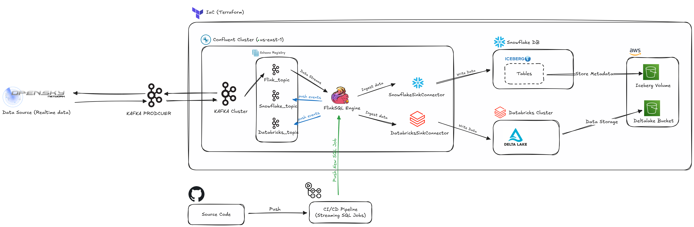

# Data Pipeline Project

This project sets up a comprehensive data pipeline using various technologies, including Kafka, FlinkSQL, Snowflake, Databricks, and AWS S3. The pipeline processes real-time data from the OpenSky Network and stores it in Snowflake and Delta Lake.

## Table of Contents
- [OpenSky API GitHub Cloning and Setting](#opensky-api-github-cloning-and-setting)
- [Architecture Graph](#architecture-graph)

## OpenSky API GitHub Cloning and Setting

To get started with the OpenSky API, you need to clone the repository and set it up locally.

### Step 1: Clone the Repository

Open a terminal and run the following command to clone the OpenSky API repository:

```sh
git clone https://github.com/openskynetwork/opensky-api
```

### Step 2: Navigate to the Repository

Change into the cloned directory:

```sh
cd opensky-api
```

### Step 3: Install Dependencies

Install the required dependencies using pip:

```sh
sudo python setup.py install
```

### Step 4: Set Up Environment Variables

Create a `.env` file in the root directory of the repository and add the necessary environment variables. Example:

```plaintext
API_KEY=your_opensky_api_key
```

### Step 5: Run the Application

Run the application using the following command:

```sh
python main.py
```

## Architecture Graph

Below is the architecture graph of the data pipeline:



### Components

1. **Data Source (Opensky Network)**: Real-time data source.
2. **Kafka Producer**: Sends data to Kafka topics.
3. **Confluent Cluster**: Hosted in AWS (us-east-1), containing multiple Kafka topics.
   - Topics: `flink_topic`, `snowflake_topic`, `databricks_topic`.
   - Schema Registry.
4. **FlinkSQL Engine**: Processes data from `flink_topic`.
5. **SnowflakeSinkConnector**: Ingests data from Kafka topics into Snowflake.
6. **DatabricksSinkConnector**: Ingests data from Kafka topics into Databricks.
7. **Snowflake DB**: Stores data ingested from Kafka.
   - Database: `TRAVEL`
   - Schema: `TRAVEL_SCHEMA`
   - Table: `TRAVEL_DATA`
8. **Databricks Cluster**: Processes data and stores it in Delta Lake.
9. **AWS S3**: Stores metadata and data.
   - Buckets: `Iceberg Volume`, `Deltalake Bucket`.
10. **CI/CD Pipeline**: Deploys streaming SQL jobs from source code in a GitHub repository.

### Detailed Description

- **Opensky Network**: Provides real-time flight data.
- **Kafka Producer**: Pushes data into Kafka topics.
- **Confluent Cluster**: Manages Kafka topics and Schema Registry.
- **FlinkSQL Engine**: Performs stream processing on Kafka data.
- **SnowflakeSinkConnector**: Writes processed data to Snowflake.
- **DatabricksSinkConnector**: Writes processed data to Databricks.
- **Snowflake**: Stores structured data for analytics.
- **Databricks**: Provides interactive analytics and machine learning capabilities.
- **AWS S3**: Stores raw and processed data.
- **CI/CD Pipeline**: Automates the deployment and management of streaming SQL jobs.

## Getting Started

Follow the steps in the [OpenSky API GitHub Cloning and Setting](#opensky-api-github-cloning-and-setting) section to set up the OpenSky API. Then, refer to the architecture graph to understand the data flow and the components involved in the pipeline.

## Contributing

We welcome contributions! Please see our [CONTRIBUTING.md](CONTRIBUTING.md) for guidelines on how to contribute to this project.

